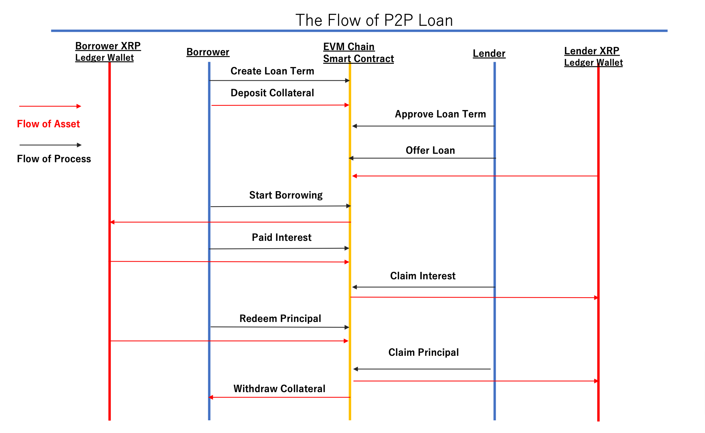

# XRP Cross Bridge Loan Application

Transform normal P2P Loan Term contract to XRP Bridge Loan Term.
In this application, while user manages loan status and collateral on EVM chain, 
actual fund lend/borrow operations will be done on XRP Ledger layer. 
(More precisely, fund will be transferred between XRP Ledger account with intermediating EVM contract)

This concept is shown in following diagram.

The contract code in this repository is still draft phase. 
To enable EVM smart contract to interact with the fund of XRP Ledger account for borrower/lender, 
contract will call createClaimId and commit functions through XRPBridgeDoor contract whenever fund transfer is required originally.
When contract receiving the fund, this will be handled in receive() function according to loan status. 
